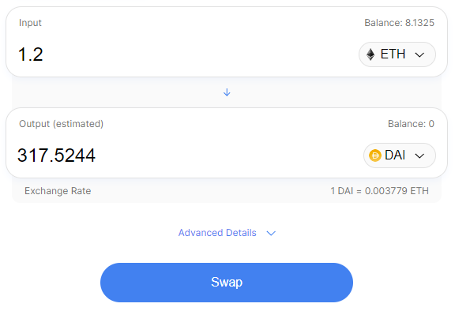

Introduction
============

Gluon это p2p платформа для обмена токенов между различными блокчейнами при контроле сделки со стороны сети валидаторов. 

[Gluon это on-chain протокол для обмена токенов между различными блокчейнами. Обмен происходит напрямую между пользователями без посредников. Обмен конролируется в смарт-контракте. Валидацией операций обмена и контролем смарт-контракта занимается сеть валидаторов. Обмен гарантируется страховым депозитом со стороны исполнителя обмена. Общий размер страхового депозита находящего на смарт-контракте отображает общую ликвидность платформы.]

1. Исполнитель блокирует страховой депозит, чем гарантирует исполнение сделки на размер страхового депозита
2. Заказчик переводить токены прямо на адрес исполнителя
3. Когда исполнитель завершит обмен, сеть валидаторов проверит сделку и разблокирует страховой депозит

API находится здесь `API <http://dc.quantbrothers.com/index.html>`_

Оглавление

* :ref:`main-steps`
* :ref:`inside`
* :ref:`smart-contract`
* :ref:`safe-depo`

.. note::
   * цена исполнения обмена определяется индексной ценой и гарантируется страховым депозитом
   * исполнитель сделки определяется на аукционе

.. attention::

   This is the documentation for the development (master) branch.
				 
.. warning::

  If you are using a environment to
  manage the build, this setting will not have any effect. Instead
  add the extra requirements to the ``environment`` file of Conda.

.. _main-steps:

Этапы
-----

* создание аукциона
   * выбор токенов и параметров обмена
   * создание аукциона
   

* проведение аукциона
	* завод средств в страховой депозит
	* заявка на участие в аукционе (блокирование депозита)
	* выбор победителя аукциона
	* перевод исходного токена исполнителю
* завершение сделки
	* возврат destination токена (смотри :ref:`main-steps`)
	* присвоение рейтинга исполнителю
	* взимание штрафа с исполнителя
	* возврат заблокированного депозита исполнителю

How to use it

Интерфейс пользователя (How to use it)

	* картинки интерфейса с шаги описание 
	
Пример интерфейса

.. _inside:

Внутринности
------------

.. _smart-contract:

Смарт-контракт
~~~~~~~~~~~~~~

	* использовается в сети Ethereum
	* для создания аукциона
	* для блокировки страхового депозита

.. _safe-depo:

Страховой депозит
~~~~~~~~~~~~~~~~~

	* Стаховой депозит размещается в смарт-контракте эфиреума
	* В момент акциона блокируется сумма равная сумме сделки
	* После завершения сделки страховой депозит полностью разблокируется
	* Если были нарушены условия сделки часть или полностью страхового депозита идёт на штрафы
	* Необходим чтобы исполнитель участвовал в сделке
	* Исполнитель может свободно заводить и выводить деньги из страхового депозита
	* После блокировки страхового депозита разблокировка производится валидаторами

Аукцион
~~~~~~~

	* создаётся заказчиком
	* чтобы участвовать в аукционе исполнители должны заблокировать страховой депозит
	* для выполнения сделки выбирает исполнитель в соответствии с рейтингом, штрафами и объёмом гарантированного депозита

