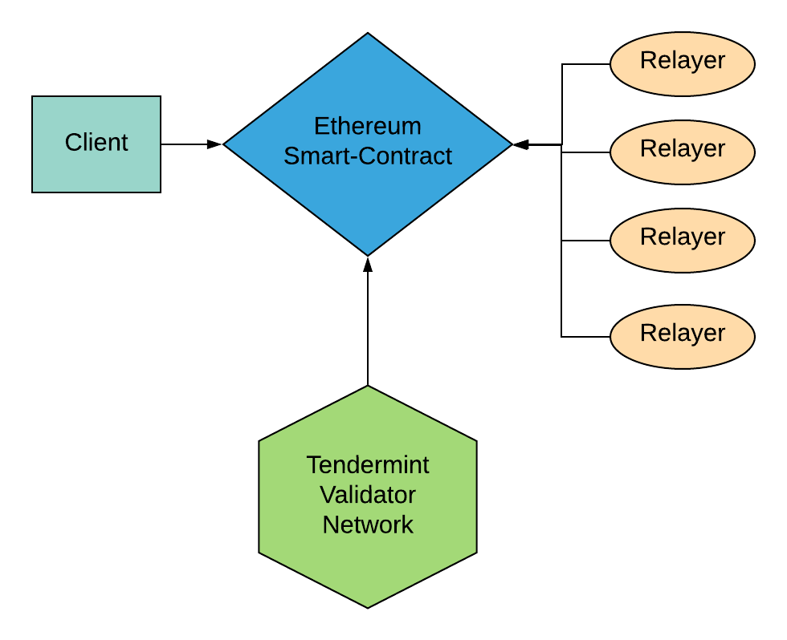
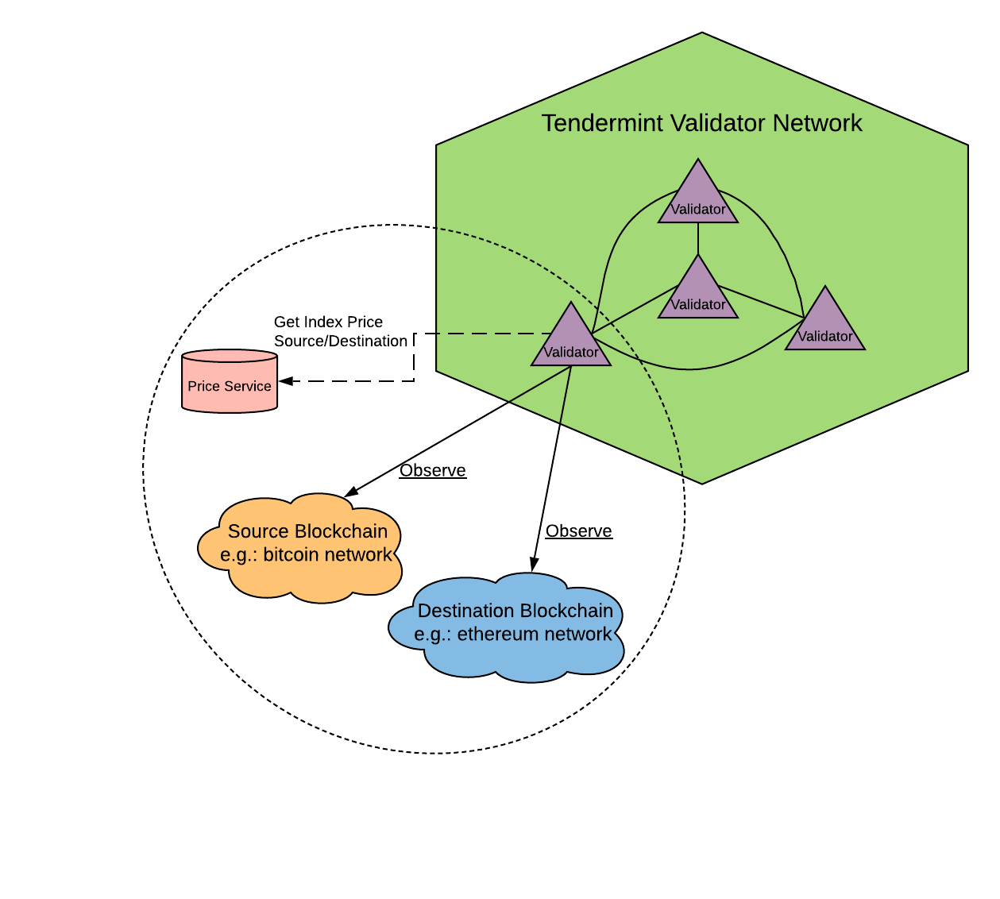

# Detailed Schemes

## Общая система работы системы

Система построена на взаимодействии всеми участниками системы через Ethereum смарт-контакты. 

* Клиент создает запрос на совершение обмена \(аукцион\)
* Исполнители конкурируя между собой получают возможность совершить обмен
* Сеть валидаторов следит за верным совершение сделки

## Принцип работы сети валидаторов

[Сеть валидаторов](entities.md#validators-network) реализована на Tendermint протоколе. Для валидации используется алгоритм BFT \([Byzantine fault tolerance](https://en.wikipedia.org/wiki/Byzantine_fault)\). Каждый валидатор наблюдает за всеми блокчейнами между которыми возможен обмен токенов. Для корректного наблюдения за блокчейном достаточно использовать две функции: высота и информацию о транзакции. Для завершения транзакции сеть валидаторов должна 

## Упрощенная схема совершения обмена

## Обмен с компенсацией клиенту

## Последовательная схема взаимодействий между разными участниками системы

1. Клиент, используя Web-сайт формирует заказ на обмен криптовалюты - указывает исходную и результирующую валюты, объем и кошелек для приема результирующей валюты.
2. В Ethereum смарт-контракт отправляется транзакция на создание нового аукциона, проставляются параметры в соответствии с запросом клиента. 
3. Исполнитель видит Ethereum event о новом аукционе. Обращается к делегату для подписи своего предложения \(bid\). Делегат возвращает подписанное и спрятанное \(sealed\) предложение исполнителя. 
4. Исполнитель создает Ethereum транзакцию на запись своего подписанного предложения для действующего аукциона в смарт-контракт. В предложении Исполнителя также указан адрес кошелька для исходной валюты.
5. По окончанию периода bidding, сеть делегатов получает список всех спрятанных bid и находит победителей в соответствии с распределением объема и рейтингов Исполнителей. В этот момент проверяется уровень коллитерации заблокированных средств ETH Исполнителей. Предложения Исполнителей с недостаточным уровнем коллитерации не учитываются.
6. Делегат переводит аукцион в состояние исполнения. На Web-сайте клиенту отображаются исходные адреса кошельков Исполнителей. 
7. Делегаты ожидают поступление средств на кошельки Исполнителей, как только средства поступают, создается Ethereum транзакция, где смарт контракт фиксирует поступление средств конкретному Исполнителю. 
8. Исполнитель видит поступление средств через Ethereum event, либо напрямую через блокчейн кошелька. Производит обмен криптовалют и отправляет результирующую валюту на кошелек клиента.
9. При наступлении времени окончания аукциона, делегаты проверяют наличие незавершенных транзакций \(mempool etc…\) на кошельке клиента. Если все операции завершены, то аукцион закрывается. Депозит Исполнителя используется для начисления комиссий делегатам. В случае невыполнения обязательств Исполнителя по данному аукциону \(либо частичного выполнения\), вычитаются средства Исполнителя на счет клиента \(использую внутреннюю цену делегатов\).
10. Факт окончания аукциона фиксируется в Ethereum смарт-контракте. Клиенту отправляется отчет о выполнении обмена.

