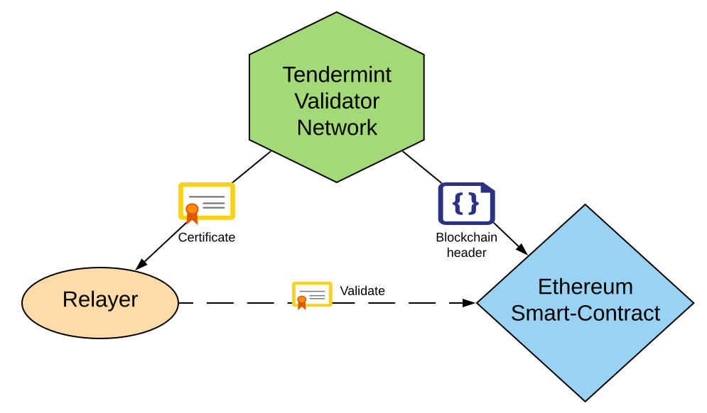
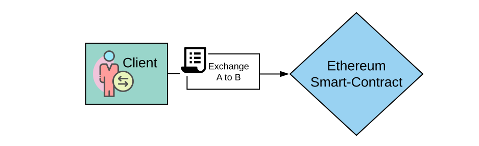
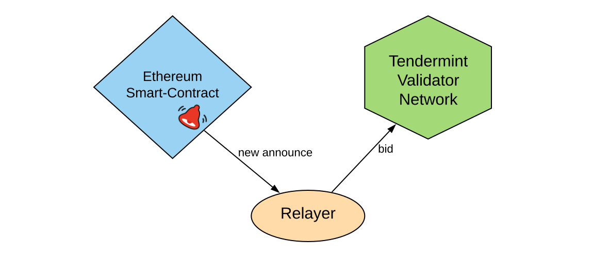
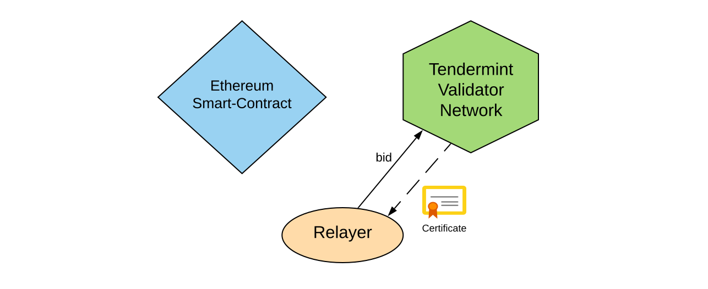
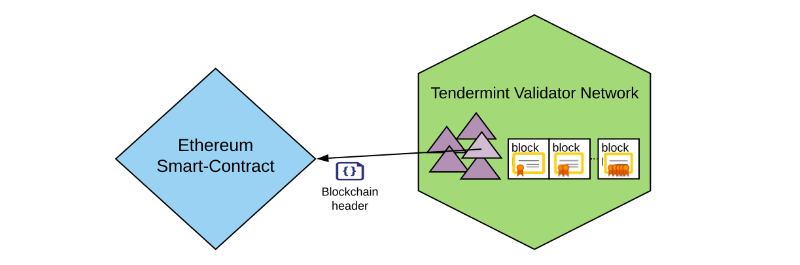
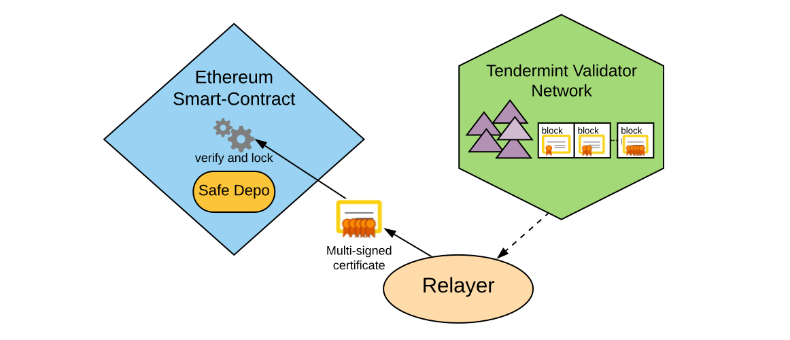
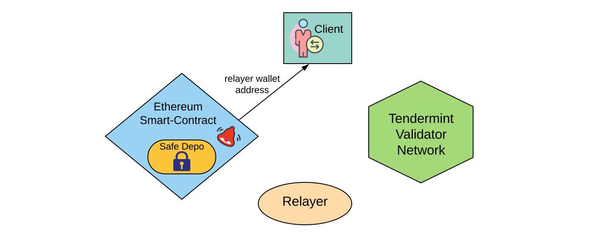

# Doublechain consensus

## Система на базе двух блокчейн-сетей

Для реализации задачи распределенного обмена токенов система Gluon использует две блокчейн сети:

* блокчейн Ethereum выбран с целью управления гарантийным обеспечением и распределения вознаграждений в соответствие с принципами DAO
* блокчейн сеть валидаторов на базе Tendermint используется для обозревания множества сторонних блокченов, токены которых участвуют в обмене.

Сеть Ethereum является наиболее популярной платформой для разработки DeFi приложений. Внутренний токен ETH имеет высокую капитализацию и может быть использован в качестве гарантийного обеспечения при работе с другими токенами.

Tendermint протокол выбран нами, как наиболее гибкий для выполнения задачи проверки совершения транзакций в сторонних блокчейн системах, таких как BTC, Monero и пр. Алгоритм консенсуса в данном протоколе использует подход [BFT](https://arxiv.org/abs/1807.04938), что освобождает участников от дорогостоящего майнинга в случае PoW или booststrap проблемы PoS алгоритмов. Уровень приложения \(или смарт-контракт\) в Tendermint не обременен ограничениями встроенного языка программирования и может быть задействован для доступа к данным как внутри собственного блокчейна, так и для чтения из внешних источников.

## Консенсус между блокчейнами

Используя две блокчейн-сети мы можем достичь консенсуса при выполнении логики смарт-контракта внутри каждой из них, но как организовать проверку корректности транзакций между этими двумя блокчейнами?

Мы выбрали подход на базе сертификатов и мульти-подписи. Рассмотрим пример, как сеть валидаторов проверяет корректность выполнения транзакции исполнителя на обработку заказа:

1. Клиент выставляет заказ на обмен токенов A на токены B, производит запись в блокчейн Ethereum

2. Исполнитель видит заказ и отправляет в сеть валидаторов запрос на обработку данного заказа

3. Если данный исполнитель побеждает в аукционе и имеет достаточное количество гарантийного обеспечения в ETH, сеть валидаторов выдает исполнителю сертификат на обработку данного заказа.

4. Каждый новый блок сети валидаторов проверяется и подписывается случайным узлом сети и добавляет подпись ранее выданным сертификатам.

5. Случайно выбранный узел сети валидаторов производит выгрузку состояния цепочки блоков в блокчейн Ethereum - высоту и хэш блока. Данное состояние, затем позволяет проверить сертификат внутри смарт-контракта Ethereum. Для уменьшения расхода gas, запись состояния производится с чередованием блоков.

6. При достаточном количестве подтверждений сертификата, исполнитель получает право на его верификацию. Для этого исполнитель передает сертификат на проверку смарт-контракту Ethereum, и если достаточное количество подписей, а также наличие у валидаторов внутренних токенов Gluon подтверждается, то гарантийное обеспечение исполнителя блокируется. Кроме проверки подписи, также проверяется, что валидаторы, подписавшие сертификат обладают минимально необходимым для данного действия количеством внутренних токенов системы Gluon.

7. Клиент, получает уведомление о назначенном исполнителе и адрес исполнителя для отправки исходных токенов.

Остальные шаги взаимодействия клиента и исполнителя, описанные в [общей диаграмме обмена](architecture.md#sequence-diagram), также происходят путем выдачи и проверки сертификатов с мульти-подписью.

Похожим образом происходит верификация cross-shard транзакций для Ethereum 2.0 \[[1](https://medium.com/nearprotocol/the-authoritative-guide-to-blockchain-sharding-part-1-1b53ed31e060)\]. Сеть использует усовершенствованный алгоритм мульти-подписи [ASM ](https://eprint.iacr.org/2018/483.pdf)на базе алгоритмов шифрования при помощи эллиптических кривых BLS \[[2](https://www.di.ens.fr/~fouque/pub/latincrypt12.pdf), [3](https://eprint.iacr.org/2018/483.pdf)\].

Система Gluon использует встроенный в Ethereum алгоритм шифрования keccak256, при переходе на Ethereum 2.0 планируется осуществить миграцию на новый алгоритм [ASM](https://eprint.iacr.org/2018/483.pdf), с целью оптимизации gas consumption.

## Обзор распространенных видов атак

Рассмотрим некоторые распространенные виды атак, которые могут быть применены к системе Gluon

| Тип атаки | Описание | Последствия для системы | Последствия для атакующего |
| :--- | :--- | :--- | :--- |
| Генерация ложных заказов | Злоумышленник создает заказы на обмен токенов, но не поставляет токены исполнителю | Срабатывают таймауты на ожидание транзакции поступления токенов. Заказ закрывается, гарантийное обеспечение исполнителя разблокируется. | Потеря gas |
| Подделка сертификата | Злоумышленник внедрился в сеть валидаторов и выдает поддельные сертификаты. | Остальные участники сети валидаторов не принимают сертификат. Смарт-контракт Ethereum не подтверждает подлинность сертификата. | Злоумышленник теряет часть своих Gluon токенов в последствии штрафа [TCR](https://hackernoon.com/token-curated-registry-tcr-design-patterns-4de6d18efa15). |
| Отказ от пересылки результирующего объема токенов, или поступивший объем не соотвествует цене | Злоумышленником в данном случае выступает исполнитель. Заказ берется на обработку, но результирующие токены не возвращаются, либо их количество слишком мало. | Система использует гарантийное обеспечение злоумышленника изымая разницу в цене в виде компенсации ETH токенами в пользу клиента. Клиент может дополнительно указать защитный минимальный объем в результирующих токенах, тогда компенсация будет рассчитана относительно этого объема, иначе относительно индексной цены. | Злоумышленник лишается части гарантийного обеспечения в ETH. |
| DDoS атаки на узлы валидатора | Злоумышленник пытается атаковать Tendermint сеть | Tendermint имеет встроенные средства от защиты, в следствие чего DDoS атаки становятся для злоумышленника весьма ресурсоемкими. Кроме того сеть продолжает работать в нормальном режиме при выходе из строя большого количества узлов. | Издержки на организацию DDoS атаки |
| DDoS атаки на web-сайт обменника | Злоумышленник пытается атаковать адрес Web-сайта обменника | Каждый узел сети валидаторов в тоже время является зеркалом web сайта обменника и может быть доступен при помощи [ens.domains](https://ens.domains/), это создает дополнительную защиту от блокировки DNS. | Издержки на организацию DDoS атаки |

Документы

1. [The authoritative guide to Blockchain Sharding](https://medium.com/nearprotocol/the-authoritative-guide-to-blockchain-sharding-part-1-1b53ed31e060)
2. [Indifferentiable Hashing to Barreto–Naehrig Curves](https://www.di.ens.fr/~fouque/pub/latincrypt12.pdf)
3. [Compact Multi-Signatures for Smaller Blockchains](https://eprint.iacr.org/2018/483.pdf)

