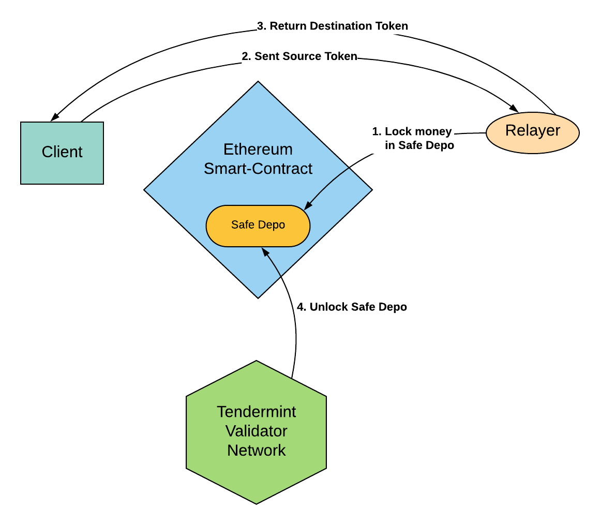
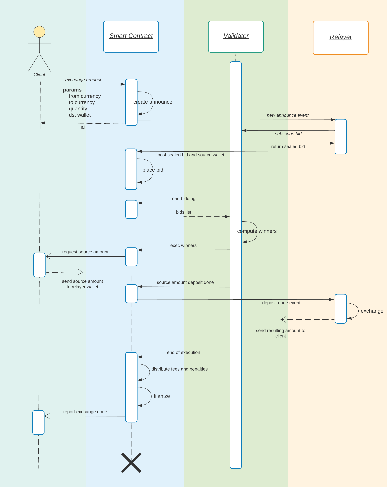

# Schemes

## General Exchange Scheme

Система построена на взаимодействии между всеми участниками системы через Ethereum смарт-контакты.

* Клиент создает запрос на совершение обмена \(аукцион\)
* Исполнители конкурируя между собой получают возможность совершить обмен
* Сеть валидаторов следит за верным совершение сделки

## Validator Network Scheme

Сеть валидаторов реализована на [Tendermint протоколе](https://tendermint.com/static/docs/tendermint.pdf). Для валидации используется алгоритм BFT \(Byzantine fault tolerance\). Каждый валидатор наблюдает за всеми блокчейнами между которыми возможен обмен токенов. Для этого достаточно использовать две функции: высота и информацию о транзакции. Для завершения обмена сеть валидаторов должна проверить состояния source and destination blockchain и что отношение source токен к destination токен соответствует индексной цене на данный момент. Такую проверку производит сеть валидаторов, это позволяет отказаться от дорогостоящих операций записи состояния в блокчейн Ethereum и значительно увеличивает пропускную способность системы. На основе проверки, валидаторы выдают сертификат исполнителю объема, а Ethereum smart-contract проверяет данный сертификат. Данный подход "Doublechain consensus" использует мульти-подпись со стороны случайного наборы нод валидаторов и является криптографически стойким по отношению к участникам системы.

## Simple exchange scheme

1. Исполнитель блокирует свои средства в ETH на смарт-контакте обменника в страховом депозите. Сумма заблокированных средств должна превышать сумму обмена с учётом коэффициента коллитерации \(сейчас x1.2\).
2. Клиент отправляет свои токены прямо на адрес Исполнителя. Если Исполнитель не выполнит свои обязательства, клиенту будут начислена компенсация в виде всего заблокированного депозита Исполнителя.
3. После совершения обмена, Исполнитель переводит Клиенту destination токен в соответствии с курсом обмена.
4. Сеть валидаторов проверяет исполнение сделки и разблокирует страховой депозит Исполнителя.

## Amends scheme

1. 1. В случае, если Исполнитель не произвёл обмен за установленное время или вернул Клиенту кол-во destination токенов не соответствующее индексу цены, сеть валидаторов выписывает штраф Исполнителю и компенсацию разницы в цене клиенту. Таким образом клиент всегда уверен, что будет совершён обмен по наилучшей цене исполнения в данный момент времени. Либо он получит дополнительную компенсацию, которая покрывает разницу в цене между индексной ценой и ценой обмена.

## Sequence Diagram

Техническое описание процесса обмена.

1. Клиент, используя Web-сайт формирует заказ на обмен криптовалюты - указывает исходную и результирующую валюты, объем и кошелек для приема результирующей валюты.
2. В Ethereum смарт-контракт отправляется транзакция на создание нового аукциона, проставляются параметры в соответствии с запросом клиента. 
3. Исполнитель видит Ethereum event о новом аукционе. Обращается к валидатору для подписи своего предложения \(bid\). Валидатор возвращает подписанное и спрятанное \(sealed\) предложение исполнителя. 
4. Исполнитель создает Ethereum транзакцию на запись своего подписанного предложения для действующего аукциона в смарт-контракт. В предложении Исполнителя также указан адрес кошелька для исходной валюты.
5. По окончанию периода bidding, сеть валидаторов получает список всех спрятанных bid и находит победителей в соответствии с распределением объема и рейтингов Исполнителей. В этот момент проверяется уровень коллитерации заблокированных средств ETH Исполнителей. Предложения Исполнителей с недостаточным уровнем коллитерации не учитываются.
6. Валидатор переводит аукцион в состояние исполнения. На Web-сайте клиенту отображаются исходные адреса кошельков Исполнителей. 
7. Валидаторы ожидают поступление средств на кошельки Исполнителей, как только средства поступают, создается Ethereum транзакция, где смарт контракт фиксирует поступление средств конкретному Исполнителю. 
8. Исполнитель видит поступление средств через Ethereum event, либо напрямую через блокчейн кошелька. Производит обмен криптовалют и отправляет результирующую валюту на кошелек клиента.
9. При наступлении времени окончания аукциона, валидаторы проверяют наличие незавершенных транзакций \(mempool etc…\) на кошельке клиента. Если все операции завершены, то аукцион закрывается. Депозит Исполнителя используется для начисления комиссий валидаторам. В случае невыполнения обязательств Исполнителя по данному аукциону \(либо частичного выполнения\), вычитаются средства Исполнителя на счет клиента \(использую внутреннюю цену валидаторов\).
10. Факт окончания аукциона фиксируется в Ethereum смарт-контракте. Клиенту отправляется отчет о выполнении обмена.

